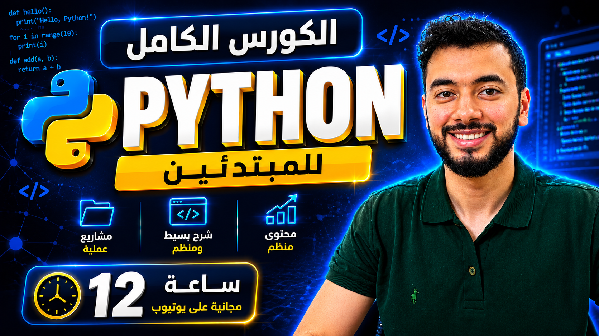

# 🐍 Python Course for Web Developers

## 📌 About This Course

Welcome to the **Python Course for Web Developers** by **Mohamed Elkashef**.

This course is designed specifically for developers who want to learn Python from scratch and use it in real-world web development projects.

Whether you're coming from HTML, CSS, JavaScript, or React, this course will help you build a strong Python foundation and prepare for backend development.

---

## 🎯 What You Will Learn

- Python Fundamentals
- Variables and Data Types
- Strings and Numbers
- Lists, Tuples, Sets, and Dictionaries
- Conditional Statements
- Loops
- Functions
- Modules and Packages
- File Handling
- Error Handling
- Object-Oriented Programming (OOP)
- Working with APIs
- Python Best Practices
- Real-world Projects

---

## 📂 Course Structure

### 01 - Numbers and Text
- Variables
- Data Types
- Strings
- Numbers
- Type Conversion

### 02 - Python Collections
- Lists
- Tuples
- Sets
- Dictionaries

### 03 - Control Flow and Loops
- If Statements
- Match Case
- For Loops
- While Loops
- Loop Control Statements

### 04 - Functions
- Function Basics
- Parameters
- Return Values
- Lambda Functions
- Scope

More sections will be added as the course progresses.

---

## 👨‍🏫 Instructor

**Mohamed Elkashef**

- Front-End Developer
- Teaching Assistant
- Udemy Instructor
- YouTube Content Creator

---

## 🎥 Watch the Course

Subscribe and follow the complete course on YouTube:

👉 https://www.youtube.com/@Mohamed.Elkashef

---

## ⭐ Support

If you find this repository helpful:

- Give it a ⭐ Star
- Share it with your friends
- Subscribe to the YouTube channel

---
